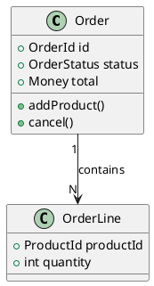
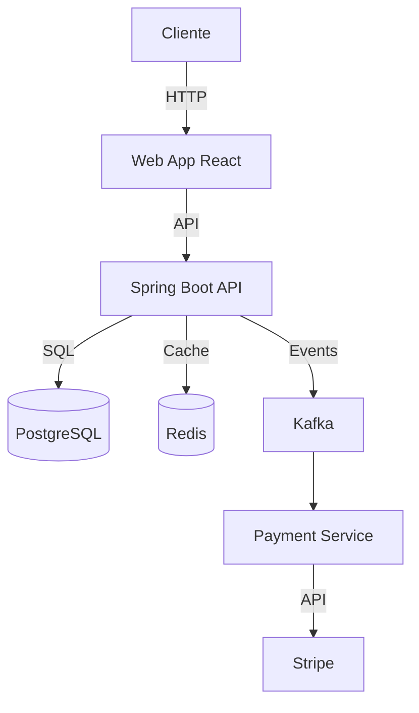

## 3. ADR (Architecture Decision Records)

### Formato estándar (Michael Nygard)

```markdown
# ADR-001: Usar PostgreSQL como base de datos principal

## Estado
ACEPTADO

## Contexto
Necesitamos una base de datos para la E-Commerce Platform.
Los requerimientos incluyen:
- Transacciones ACID para pedidos y pagos
- Consultas complejas con joins (reportes)
- Datos financieros que requieren consistencia fuerte

## Decisión
Usaremos PostgreSQL como base de datos principal.
Alternativas consideradas: MongoDB, MySQL, CockroachDB.

## Consecuencias
**Positivas**:
- Transacciones ACID garantizadas
- Madurez y comunidad grande
- Soporte SQL completo (joins, subqueries, CTEs)

**Negativas**:
- Escalado horizontal más complejo (vs CockroachDB)
- Esquema rígido (vs MongoDB)
- No es ideal para full-text search (necesitaremos Elasticsearch como complemento)
```

### Estado de un ADR

| Estado | Significado |
|--------|-------------|
| **Proposed** | Propuesto, en discusión |
| **Accepted** | Aceptado e implementado |
| **Deprecated** | Ya no se usa pero no reemplazado |
| **Superseded** | Reemplazado por otro ADR |

### Almacenamiento
```
docs/
└── adr/
    ├── ADR-001-usar-postgresql-como-base-de-datos.md
    ├── ADR-002-estilo-comunicacion-eventos-kafka.md
    ├── ADR-003-cqrs-para-modulo-pedidos.md
    ├── ADR-004-descomposicion-bounded-contexts.md
    └── ADR-005-frontend-react-typescript.md
```

---

## 4. Structurizr (C4 as Code)

Structurizr permite definir el C4 Model en un DSL y generar diagramas automáticamente.

```
workspace "E-Commerce Platform" {
    model {
        customer = person "Cliente" "Usuario web"
        admin = person "Administrador" "Gestiona la plataforma"

        ecommerce = softwareSystem "E-Commerce Platform" "Plataforma de compras online" {
            webapp = container "Web Application" "React SPA" "Proporciona UI al cliente"
            api = container "API Application" "Spring Boot" "Lógica de negocio"
            database = container "Database" "PostgreSQL" "Datos transaccionales"
            cache = container "Cache" "Redis" "Caché de consultas"
        }

        stripe = softwareSystem "Stripe" "Procesador de pagos"
        sendgrid = softwareSystem "SendGrid" "Email service"

        customer -> webapp "Compra productos"
        admin -> webapp "Gestiona"
        webapp -> api "API calls"
        api -> database "Guarda/Lee"
        api -> cache "Cachea consultas"
        api -> stripe "Procesa pagos"
        api -> sendgrid "Envía emails"
    }
    views {
        systemContext ecommerce "S01-Context" {
            include *
            autolayout
        }
        container ecommerce "C01-Containers" {
            include *
            autolayout
        }
    }
}
```

---

## 5. PlantUML

Diagramas UML desde texto. Ideal para markdown.



---

## 6. Mermaid

Diagramas nativos en Markdown (GitHub, Notion).



---

## 7. Documentación Viva vs Estática

| Aspecto | Documentación Viva | Documentación Estática |
|---------|-------------------|----------------------|
| **Ubicación** | En el repositorio (docs/) | Wiki externa |
| **Actualización** | Junto con el código | Manual, se desactualiza |
| **Formato** | Markdown, diagramas as code (Structurizr) | PDF, Word, Confluence |
| **Control de versiones** | Git (cambios trackeados) | No hay versiones |
| **Revisión** | Code reviews incluyen docs | Nadie revisa |

> **Regla**: La documentación que no está en el repositorio, no existe.

---

## 8. Anti-patrones de Documentación

| Anti-patrón | Descripción | Solución |
|-------------|-------------|----------|
| **Wiki antipattern** | Documentar en wiki y nunca actualizar | Docs as code en repositorio |
| **Big Design Up Front** | Documentar todo antes de empezar | Documentar decisiones, no diseño completo |
| **Diagramas sin contexto** | Diagramas bonitos sin significado | C4 Model con niveles claros |
| **Over-documentation** | Documentar cada línea de código | Documentar decisiones y estructura, no implementación |
| **No documentation** | No documentar nada | Al menos ADRs de decisiones clave |

---

## 9. Herramientas

| Herramienta | Uso | Tipo |
|-------------|-----|------|
| **Structurizr** | C4 Model as code | DSL → Diagramas |
| **PlantUML** | UML, C4, secuencia, despliegue | Texto → Diagramas |
| **Mermaid** | Diagramas en markdown | Texto → Diagramas |
| **Draw.io** | Diagramas manuales | GUI |
| **Excalidraw** | Pizarra colaborativa | GUI |
| **ArchUnit** | Arquitectura como tests | Código → Tests |

---

## 10. Laboratorio

1. Crear C4 Model para E-Commerce Platform (Context + Container + Component)
2. Escribir ADRs para decisiones clave:
   - ADR-001: Base de datos PostgreSQL
   - ADR-002: Comunicación asíncrona con Kafka
   - ADR-003: CQRS para pedidos
3. Diagramar con Structurizr DSL
4. Documentar en docs/ en el repositorio
