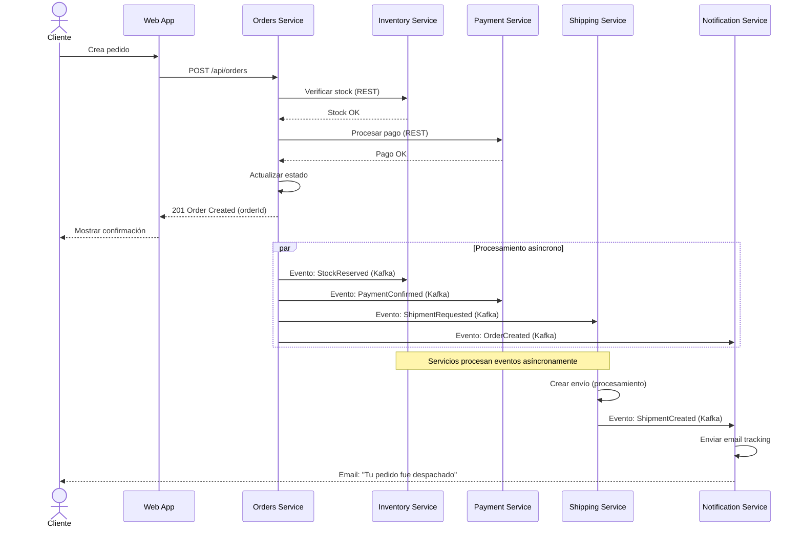

## Solución Ejercicio 3: Diagrama de Secuencia



---

## Solución Ejercicio 4: Arquitectura como Tests (ArchUnit)

```java
@AnalyzeClasses(packages = "com.ecommerce")
public class ArchitectureTest {

    @ArchTest
    static final ArchRule domain_should_not_depend_on_infrastructure =
        classes()
            .that().resideInAPackage("..domain..")
            .should().onlyDependOnClassesThat()
            .resideOutsideOfPackages("..infrastructure..", "..springframework..")
            .because("El dominio no debe depender de infraestructura");

    @ArchTest
    static final ArchRule controllers_should_call_usecases_not_repositories =
        classes()
            .that().areAnnotatedWith(RestController.class)
            .should().onlyHaveDependentClassesThat()
            .resideInAPackage("..application..")
            .andShould().onlyAccessClassesThat()
            .resideOutsideOfPackages("..infrastructure..repository..")
            .because("Los controllers deben llamar a casos de uso, no directamente a repositorios");

    @ArchTest
    static final ArchRule no_cyclic_dependencies_between_modules =
        slices()
            .matching("com.ecommerce.(*)..")
            .should().beFreeOfCycles()
            .because("Los módulos no deben tener dependencias cíclicas");

    @ArchTest
    static final ArchRule class_naming_convention =
        classes()
            .that().resideInAPackage("..controller..")
            .should().haveSimpleNameEndingWith("Controller")
            .andShould().beAnnotatedWith(RestController.class)
            .andShould().bePublic()
            .because("Los controllers deben terminar en 'Controller' y ser públicos");

    @ArchTest
    static final ArchRule domain_should_not_import_spring =
        noClasses()
            .that().resideInAPackage("..domain..")
            .should().dependOnClassesThat()
            .resideInAnyPackage("org.springframework..")
            .because("El dominio no debe tener dependencias de Spring");

    @ArchTest
    static final ArchRule services_should_only_be_used_by_controllers_or_other_services =
        classes()
            .that().resideInAPackage("..application..")
            .should().onlyBeAccessed()
            .byAnyPackage("..controller..", "..application..", "..configuration..")
            .because("Los servicios de aplicación solo deben ser usados por controllers u otros servicios");
}
```

